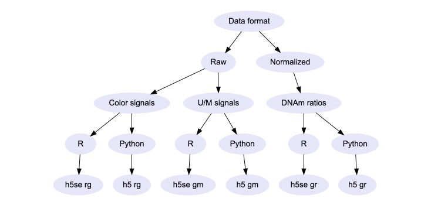

This vignette provides instructions on how to load, convert, and save DNA 
methylation (DNAm) array datasets using the `minfi` and `HDF5Array` R packages. 
These tasks show how to make and work with `SummarizedExperiment` objects, which 
are used by DNAm analysis packages such as `wateRmelon` and `ChAMP`. More in-depth 
discussion of DNAm data types and storage formats can be found in the 
[`recountmethylation` User's Guide](https://bioconductor.org/packages/release/bioc/vignettes/recountmethylation/inst/doc/recountmethylation_users_guide.html).

```{r setup, include=FALSE}
knitr::opts_chunk$set(echo = TRUE, eval = FALSE)
libv <- c("minfiData", "HDF5Array", "minfi")
sapply(libv, library, character.only = T)
```

# Obtaining example data

For demonstration and development purposes, we can load the example `RGChannelSet` 
data provided in the `minfiData` package. This load example data generated for 
the HM450k array platform.

```{r}
rg.hm450k <- get(data("RGsetEx"))
```

See the `minfiDataEPIC` package for similar small example datasets generated 
from the EPIC array platform.

# Converting data

## Converting data between platforms

We can convert between HM450K and EPIC array platforms using `convertArray()` function
in the `minfi` package.

```{r}
rg.epic <- convertArray(rg.hm450k, "IlluminaHumanMethylationEPIC")
```

This makes a new digital array object that mimics data
generated from the EPIC array, which can be convenient for harmonizing samples
across platforms or passing data to functions written for a particular platform.

## Converting data between `SummarizedExperiment` classes

To convert between and `RGChannelSet` and other classes, we need to call the 
functions `preprocessRaw()` (or some other preprocessing function which returns
a `MethylSet`), and `mapToGenome()`, which will map a `SummarizedExperiment` 
object to the genome coordinates. The latter is useful for genome or annotation-based queries and it may be required by certain normalization and analysis functions.

We can convert the object `rg` to a `GenomicMethylSet` using:

```{r}
ms.hm450k <- preprocessRaw(rg) # make MethylSet
ms.hm450k <- mapToGenome(ms.hm450k) # make GenomicMethylSet 
```

We can also make new `SummarizedExperiment` objects manually by specifying the
different fields for assays, metadata, experiment details, etc. This is useful
when, for instance, we only have a matrix of DNAm signals but we need to pass
a valid `SummarizedExperiment`-type object to an analysis function.

We can make a non-normalized `GenomicRatioSet` from the object `ms.gr.hm450k` as 
follows:

```{r}
gr.hm450k <- GenomicMethylSet(gr = granges(ms.hm450k),
                              Meth = getMeth(ms.hm450k),
                              Unmeth = getUnmeth(ms.hm450k),
                              annotation = annotation(ms.hm450k))
```

For details about similar constructor functions for different `SummarizedExperiment`
classes, you can consult the function documentation using `?RGChannelSet`,
`?MethylSet`, `?GenomicMethylSet`, `?RatioSet`, and `?GenomicRatioSet`.

## Converting between standard and `DelayedArray`-backed objects

We can convert a standard matrix-backed `SummarizedExperiment` object, such as 
shown above, into a `DelayedArray`-backed object by first saving with `saveHDF5SummarizedExperiment()`
from the `HDF5Array` package. This will recast and store the new object in a new directory.

```{r}
saveHDF5SummarizedExperiment(gr.hm450k, dir = "gr_h5se_new")
```

We load the new `DelayedArray`-backed data with `loadHDF5SummarizedExperiment()`,
and this should realize a subset of the data in memory.

```{r}
gr.h5se <- loadHDF5SummarizedExperiment(dir = "gr_h5se_new")
```

Now the table returned from running `getBeta(gr.h5se)` or `getM(gr.h5se)` inherits 
from classes `DelayedArray` and `DelayedMatrix`.

## Choosing the correct data type to use

The compiled DNAm array data in `recountmethylation` covers three formats (`rg`, 
`gm`, and `gr`) and 2 storage formats (HDF5 and `DelayedArray`). In general, R 
users will want to use the `DelayedArray`-backed object formats. These appear as
directories with `h5se` in their name containing a large assays file and a smaller
metadata file. Users of Python and other programming languages besides R will 
likely prefer to use the HDF5 database files, which have `h5` in their names. 

You may find the following decision tree diagram helpful if you are uncertain about
what data type or storage format will be most useful to you:



# Saving data

## Saving flat tables from DNAm array datasets

We can extract flat tables of the assays or sample metadata from either matrix-backed
or `DelayedArray`-backed `SummarizedExperiment` objects. The specific functions 
will depend on the specific data format, but in general you can think of the 
assays data such as the Red channel signal or Beta-values matrix as the main
dataset of CpG probes (rows) and samples (columns). 

For this main DNAm signals dataset, the `rowData` and annotations obtainable from
`getAnnotation` contain the probe-level metadata including manifest-based annotations
and genome locations. By contrast, the `colData` or `pData` matrix contains the 
sample-level metadata, which may include information such as demographic information, 
tissue type, disease condition, and more.

We can extract the individual flat files and save these as R binary files as follows:

```{r, eval = F}
# get flat files
m.beta <- getBeta(gr.h5se)
anno <- as.data.frame(getAnnotation(gr.h5se))
coldata <- as.data.frame(colData(gr.h5se))
# save flat files
save(m.beta, file = "mbeta_new.rda")
save(anno, file = "anno_new.rda")
save(coldata, file = "coldata_new.rda")
```

To instead write flat files to new tables such as `.csv` files, we can use one of
the following:

```{r, eval = F}
write.table(m.beta, file = "mbeta_new.txt")
write.csv(m.beta, file = "mbeta_new.csv")
data.table::fwrite(m.beta, file = "mbeta_new.txt")
```

It will generally take longer to write to a new flat table (e.g. file with `.csv` 
or `.txt` extension) than to a binary file (e.g. file with `.rda` extension), and 
the time difference will increase with the size of the dataset being saved. Functions 
such as `fread` and `fwrite` from the `data.table` package work similar to the base 
R functions including `read.csv` and `write.csv`, but they can be many times faster. 
They are recommended when working with larger datasets, such as is likely encountered 
when working with the `recountmethylation` data compilations.

## Saving `SummarizedExperiment` objects

Standard matrix-backed `SummarizedExperiment` objects, such as `RGChannelSets`, 
`MethylSets`, and `GenomicRatioSets`, can all be saved like standard R objects.

```{r, eval = F}
save(rg, file = "rg_new.rda")
save(gm, file = "gm_new.rda")
save(gr, file = "gr_new.rda")
```

## Saving `DelayedArray`-backed objects

When working with full-sized compilation files, you may find the dataset directory 
for an `h5se` of interest already exists and you simply want to update it. These
update operations could include subsetting the samples or probes in the compilation,
or adding new metadata columns. In these cases, repeatedly saving the 
`DelayedArray`-backed datasets with `saveHDF5SummarizedExperiment()` is very 
time-consuming and not necessary. Instead, use `quickResaveHDF5SummarizedExperiment()` 
like so:

```{r}
rg.h5se <- rg.h5se[seq(1000),] # subset the h5se object
quickResaveHDF5SummarizedExperiment(rg.h5se) # rapidly update stored file
```

In general, you will only need to use `saveHDF5SummarizedExperiment()` when saving 
a brand new `DelayedArray`-backed object.

# Conclusions

We have seen how to load, convert, and save DNAm array datasets using functions
from `minfi` and `HDF5Array`, with runnable examples using an example `RGChannelSet`.

For more in-depth discussion of the compilations, data classes, and storage formats, see: 

* [`recountmethylation` User's Guide](https://bioconductor.org/packages/release/bioc/vignettes/recountmethylation/inst/doc/recountmethylation_users_guide.html) -- Detailed discussion of compiled data,
compilation formats, troubleshooting, and more.
* [Bioc 2021 lecture](https://github.com/metamaden/recountmethylation_bioc2021) -- Tutorial materials and presentation
